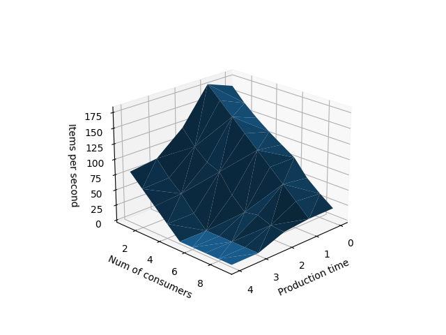

# Class 3 - Producer-consumer problem
Third classes focuses on producer-consumer problem and experimenting with the potentional variables in this problem. Branch consists of one main.py file which contains code for the experiments.

Run the program with:
```
python main.py
```

## Experimenting variables
In the experimenting function which iterates over two variables - number of consumers and the production time.

Consumers were in range of 1-10

Production time in range 0-5

The figure bellow shows the relationships between the possible variations of the experimenting variables:

